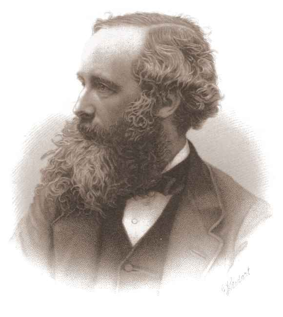

##What is it?

- Radar is a radiolocation system that uses radio waves to determine the distance (ranging), angle (azimuth), and radial velocity of objects relative to the site.

- A type of active sensor - directs its signal to the object and then checks the response – the received quantity.

- Radar is a ranging instrument: (RAdio Detection And Ranging).

- Is a sensor assisting in ranging with radio signals. Its specific feature is the antenna emitting impulses. 

- Is used to detect and track aircraft, ships, spacecraft, guided missiles, and motor vehicles, and map weather formations, and terrain.

```{r echo=FALSE, out.width='30%',fig.align='center'}

```
---
##How does it work?

- When the energy flow in radar active remote sensing meets an obstacle, it scatters back to the sensor to some degree. Based on its amount and travelling time, it is possible to estimate how far the target is.

- Transmitter creates EM waves (radio or microwaves) -> antenna acts as transmitter of EM waves -> EM waves sent to the atmosphere  -> EM waves hit target object/location and reflect back to receiver -> receiver and processor determine the properties of the object, such as location, speed, etc -> signal received is transformed into video format.

- Two primary advantages of radars: all-weather and day /night imaging.

---
##History of radar

- Began from classical experiments on electromagnetic radiation conducted by German physicist Heinrich Hertz during the late 1880s. Hertz set out to verify experimentally the earlier theoretical work of Scottish physicist James Clerk Maxwell.

- Maxwell had formulated the general equations of the electromagnetic field, determining that both light and radio waves are examples of electromagnetic waves governed by the same fundamental laws but having widely different frequencies.

- Maxwell’s work led to the conclusion that radio waves can be reflected from metallic objects and refracted by a dielectric medium, just as light waves can. 

- Hertz demonstrated these properties in 1888.

.pull-left[
```{r echo=FALSE, out.width='30%',fig.align='center',fig.cap='Heinrich Hertz'}

```
]

.pull-right[
```{r echo=FALSE, out.width='30%',fig.align='center',fig.cap='James Clerk Maxwell'}

```
]
---
##Applications of radars in the modern world

###Aviation
- Aircraft can land in fog at airports equipped with radar-assisted ground-controlled approach systems in which the plane's position is observed on precision approach radar screens by operators who thereby give radio landing instructions to the pilot, maintaining the aircraft on a defined approach path to the runway.

```{r echo=FALSE, out.width='40%',fig.align='center',fig.cap='An example of a radar display used in aviation'}

```

---
##Applications of radars in the modern world

###Marine radar
- Used to detect other ships and land obstacles, to provide bearing and distance for collision avoidance and navigation at sea. These instruments use a rotating antenna to sweep a narrow beam of microwaves around the surrounding water surface, detecting targets by microwaves reflected from them, generating a picture of the ship's surroundings on a display screen.

```{r echo=FALSE, out.width='30%',fig.align='center', fig.cap='a marine radar that can be found on top of a ship'}

```

- Allows ships to navigate “blind”, meaning no visibility during bad weather conditions.
---
##Applications of radars in the modern world

###Weather monitoring

- Primary tool for short-term weather forecasting, also used to watch for severe weather.

- Weather radars send out electromagnetic pulses to measure the location and intensity of precipitation - including rain, hail and snow - in real time.

```{r echo=FALSE, out.width='40%',fig.align='center', fig.cap='a two dimensional image of a thunderstorm, displayed using a Plan Position Indicator (PPI)'}

```

---

##Journal articles which have used data from radar sensor capture

###Weather prediction
**Title**: The Role of Weather Radar in Rainfall Estimation and Its Application in Meteorological and Hydrological Modelling—A Review

- A condensed view on the benefits as well as limitations of radar data for hydrological and meteorological applications.

- Study covers the impact and pertinence of high temporal resolution of weather radar, as well as relevant challenges in remotely sensed data for weather prediction. 

- Aim of study is to understand the breadth of radar data applications to help carve out future possibilities within the realm of hydrological and meteorological applications.
---
##Journal articles which have used data from satellite sensor capture

###Object detection
**Title**: Accessible Real-Time Surveillance Radar System for Object Detection

- The proposal of a lighter, faster, and safer radar system to help with detection of unmanned ground and aerial vehicles. Object proposal aims to act as a surveillance system to address potential catastrophic threats in public places.
---
##Reflection

- The information provided by radar includes the bearing and range (and therefore position) of the object from the radar scanner. It is thus used in many different fields where the need for such positioning is crucial(aircraft, automobiles, ships).

- Within realm urban spatial science, remotely sensed data from radars can be used to monitor weather forecasting to help determine changes in climate. This is tremendously helpful to not only track gradual changes in weather, but also allows for tracking of areas most prone to extreme weather conditions. 

- Subsequently, this can help in efficient disaster response. Also important to take into account the evolution of radar technology, and how improvement in its development allows for better remotely sensed imagery, allowing for more accurate image interpretation and hence, forecasting.

---
##References

Park, S. et al. (2020) “Accessible real-time surveillance radar system for object detection,” Sensors, 20(8), p. 2215. Available at: https://doi.org/10.3390/s20082215. 

Sokol, Z. et al. (2021) “The role of weather radar in rainfall estimation and its application in meteorological and hydrological modelling—a review,” Remote Sensing, 13(3), p. 351. Available at: https://doi.org/10.3390/rs13030351. 

